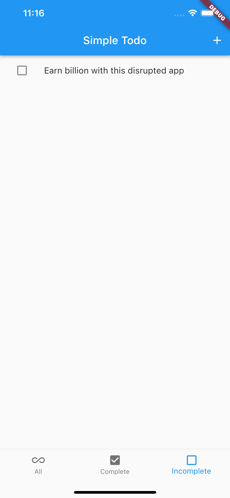
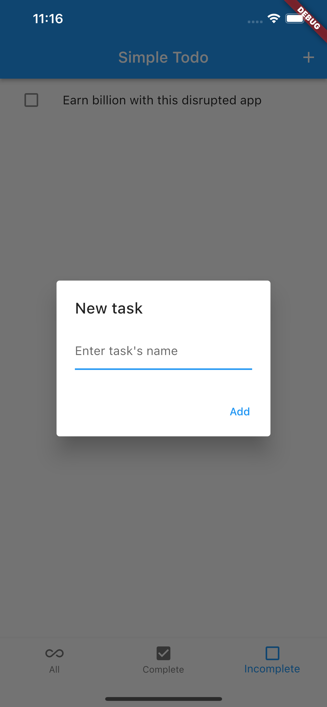

# Simple Todo

This project demonstrates the usage of layered architecture and writing tests.

## Screenshot:

|  |  |  |  |
| --- | --- | --- | --- |

## Features:
- Create/delete task
- Complete/uncomplete task

## Architecture:
&nbsp;


## Getting Started

Fetch the dependencies:
```
flutter pub get
```

Run:
```
flutter run
```

Test:
```
flutter test
```

<br>
<br>
Thank you!

